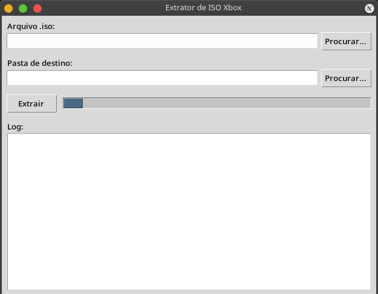

XIso

Extrator de imagens **XDVDFS (.ISO)** para **Xbox Original** e **Xbox 360**, desenvolvido em Python para Linux.

O projeto possui duas versões:

- 🖥 Interface gráfica (Tkinter)
- 💻 Linha de comando (CLI)

Foi criado como uma alternativa ao **ExtractXISO** do Windows, funcionando de forma nativa no Linux, sem dependências externas além do Python.

---

## Screenshot

<p align="center">
  
</p>

---

## Recursos

- ✔ Suporte ao Xbox Original
- ✔ Suporte ao Xbox 360 (XGD2 e XGD3)
- ✔ Detecção automática do layout da ISO
- ✔ Varredura automática quando necessário
- ✔ Extração preservando toda a estrutura de diretórios
- ✔ Interface gráfica simples em Tkinter
- ✔ Versão para Terminal (CLI)
- ✔ Escrito 100% em Python

---

## Requisitos

Python 3

Para utilizar a interface gráfica:

```bash
sudo apt install python3-tk
```

---

## Instalação

Clone o repositório:

```bash
git clone https://github.com/SEU_USUARIO/XIso.git
cd XIso
```

---

# Interface Gráfica

Execute:

```bash
python3 xiso_extract_gui.py
```

Selecione:

- Arquivo ISO
- Pasta de destino

Clique em **Extrair**.

Durante a extração o log exibirá todo o processamento em tempo real.

---

# Linha de Comando

Extrair uma ISO:

```bash
python3 xiso_extract.py jogo.iso
```

Escolher pasta de saída:

```bash
python3 xiso_extract.py jogo.iso -o Jogos/
```

Listar conteúdo:

```bash
python3 xiso_extract.py jogo.iso -l
```

Modo Verbose:

```bash
python3 xiso_extract.py jogo.iso -v
```

Combinando opções:

```bash
python3 xiso_extract.py jogo.iso -o Jogos/ -v
```

---

# Estrutura

```
XIso/
│
├── screenshots/
│   └── gui.png
│
├── xiso_extract.py
├── xiso_extract_gui.py
├── README.md
├── LICENSE
└── .gitignore
```

---

# Como funciona

O XIso localiza automaticamente a assinatura **XDVDFS** presente na imagem.

São verificados os layouts conhecidos do:

- Xbox Original
- Xbox 360 XGD2
- Xbox 360 XGD3

Caso nenhum seja encontrado, o programa realiza uma varredura completa da ISO procurando a assinatura do sistema de arquivos.

Após localizar o volume, toda a árvore de diretórios é reconstruída e os arquivos são extraídos mantendo a estrutura original.

---

# Autor

Desenvolvido por PrymeTiveHK
